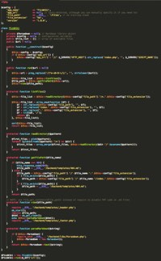

#  PicoWiki

**_PicoWiki is a super tiny and simple file-based Wiki system._**

## Features

- **Markdown** Formatting, links, etc.
- **Install in 2 seconds** Just place a folder in your server
- **File-based** Easily editable
- **Extensible** Less than 100 lines of code
- **Fast** Uses very low bandwidth
- **Powerful** You can use PHP code anywhere

## Setup

See [Setup](files/setup.md) for instructions.

## License & Contact

&copy; <?=date('Y')?> [Xavi Esteve](https://xaviesteve.com/). Licensed under [MIT](https://opensource.org/licenses/MIT).

Parsedown by Emanuil Rusev also licensed under a MIT License.

## Contributing

PicoWiki is a single PHP class with 7 methods, all in less than 100 lines of code, ready to be extended. New features I can think of right (through plugins ideally) now are:

- Checking for broken links (links to pages that don't exist yet)
- Code snippets to load YouTube videos or Google Maps, etc.
- Sitemap generator
- Auto-translate
- Web-based file editor to edit files directly via browser
- Themes

If you'd like to **contribute** please do, I am quite active on Github and usually merge Pull Requests in a few hours or days.

When I say it's tiny I mean this, the whole app is just this code:

