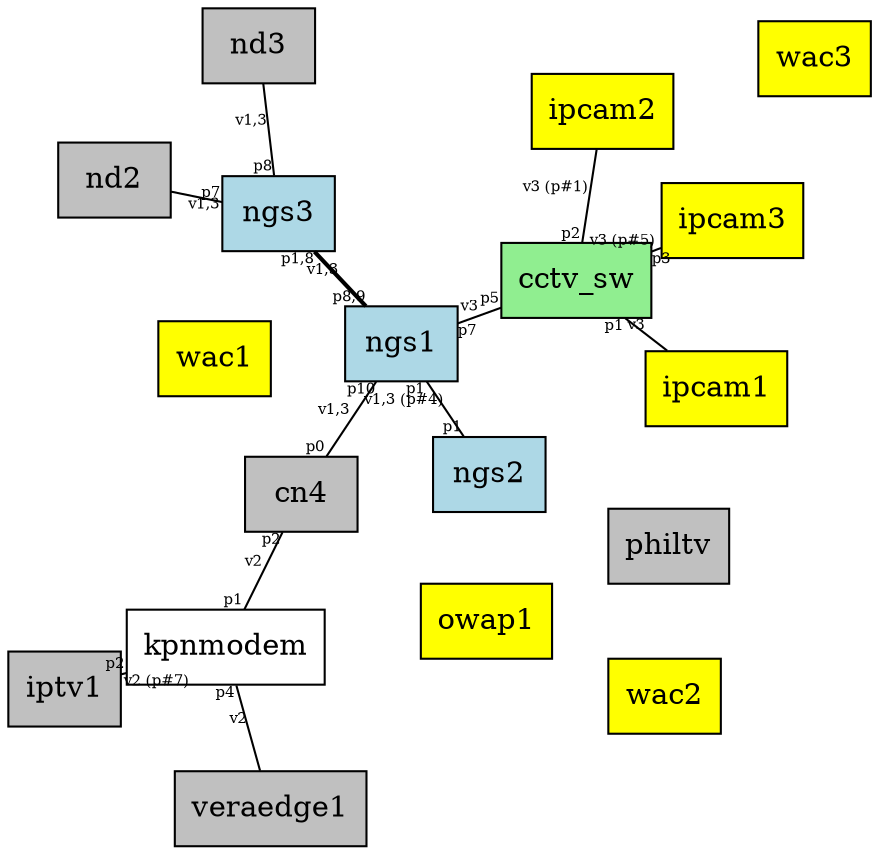

[toc]

# Other plugins

## wiki links

- [[NanoWiki]]
- [[NanoWiki/testcode.md target="_blank"|testcode in a new window]]
- [[]] shouldn't work
- {{NanoWiki/static/picowiki-favicon.png}}
- {{NanoWiki/static/picowiki-favicon.png width=32 height=32}}
- [[not-found.md]]
- https://www.php.net/manual/en/functions.arguments.php
- {{NanoWiki/static/picowiki-favicon.png|PicoWiki icon}}

## Emojis

- (y)
- (n)
- :rocket:

## Vars

- $meta.file-path$
- $config.app_url$
- $url$
- $tags$
- $meta.file-tags$

***

$attachments$


# Markdown tests

## Simple markups

- ~~Strike through~~
- [x] or [x]
- [ ] or [ ]
- [x] ~~strike-through~~ (del)
- [ ] ++insert++ (ins)
- [ ] ^^superscript^^ (sup)
- [ ] ,,subscript,, (sub)

## Tables

| table | is table |
|---|--|
| ABC | BCA |
| 1 | 2 |


| >     | >           |   Colspan    | >           | for thead |
| ----- | :---------: | -----------: | ----------- | --------- |
| Lorem | ipsum       |    dolor     | sit         | amet      |
| ^     | -           |      >       | right align | .         |
| ,     | >           | center align | >           | 2x2 cell  |
| >     | another 2x2 |      +       | >           | ^         |
| >     | ^           |              |             | !         |

| Item      | Value |
| --------- | -----:|
| Computer  | $1600 |
| Phone     |   $12 |
| Pipe      |    $1 |

| Function name | Description                    |
| ------------- | ------------------------------ |
| `help()`      | Display the help window.       |
| `destroy()`   | **Destroy your computer!**     |


## lists

* [ ] item 1 [ ] or [x]
* [x] item 2
* [ ] item 3
* no match
* test line break \
  like this
* but not like
  that

1. one
2. two
3. three

* item
  more items
* item
  - item
  - item
    - item
    - item
* item
* item
- item
  1. abc
  2. cjd

***

* [ ] item
  more items
* [ ] item
  - [x] item
  - [ ] item
    - [ ] item
    - [x] item
* item
* item
- item
  1. abc
  2. cjd
  10. dkf

## Block Quotes

> block quotes
> are here.

## Emojis

Gone camping! :tent: Be back soon.

That is so funny! :joy:

## Fenced code blocks


```php
    protected function blockListComplete(array $Block)
    {
        if (isset($Block['loose']))
        {
            foreach ($Block['element']['text'] as &$li)
            {
                if (end($li['text']) !== '')
                {
                    $li['text'] []= '';
                }
            }
        }

        return $Block;
    }

```

## Graphviz test




## svgbob

``` lineart
o->  Quick logo scribbles
        .---.                      _
       /-o-/--       .--.         |-|               .--.
    .-/ / /->       /--. \     .--)-|    .--.-.    //.-.\
   ( *  \/         / O  )|     |  |-|    |->| |   (+(-*-))
    '-.  \        /\ |-//      .  * |    '--'-'    \\'-'/
       \ /        \ '+'/        \__/                '--'
        '          '--'
                                           _____
       .----.               _             /   __)\
       |    |           ,--(_)            |  /  \ \
     __|____|__       _/ .-. \         ___|  |__/ /
    |  ______--|     (_)(   ) )       / (_    _)_/
    `-/.::::.\-'       \ `-'_/       / /  |  |
     '--------'         `--(_)       \ \__/  |
                                      \(_____/
```

# headown

# h1

#++

# h2

#--

# h1

# includes

including index.md

$include: NanoWiki/index.md $

including non-existing file

$include: not-found.md $
